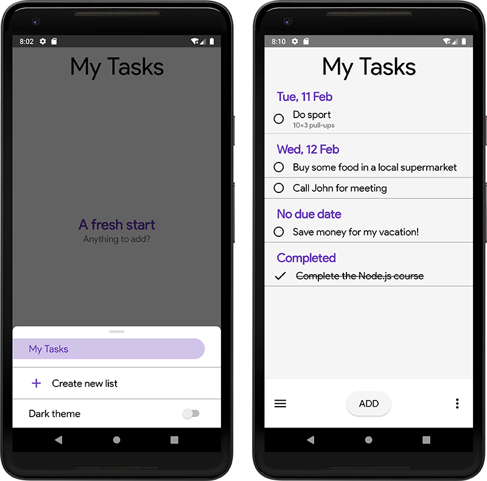

# RoutineTracker
A light app which will help you with tracking all your tasks and maybe the whole routine in the future! It was made specifically as a first-semester university project.
# Technologies
* Kotlin, as a main language;
* Android Architecture Components
* Jetpack library
# Deploying
* Clone the repo
* Run your Android emulator (minSdkVersion: 26)
* Install the app - enjoy!

